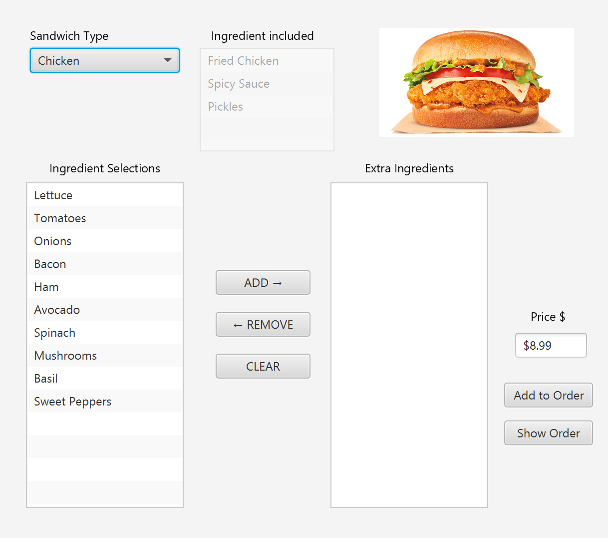

# SandwichOrdingApp
Use JavaFX and Scenebuilder to develop a software system for ordering sandwiches. Customer can choose between Chicken, Beef, and Fish sandwiches. Add up to 6 extras on each sandwich and add to order. Multiple orders can be created using two controller screens.

